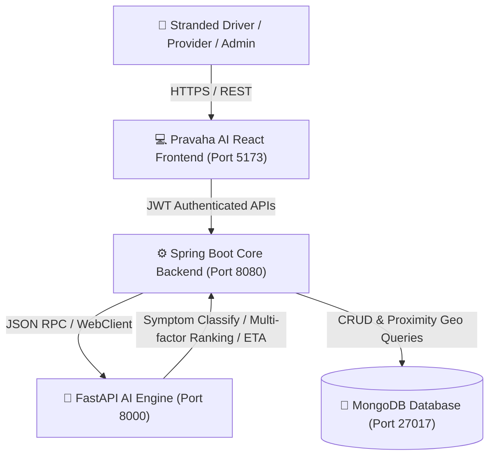

<div align="center">


# Pravaha AI
### *MOVEMENT • SUPPORT • SAFETY*

**An AI-Powered On-Road Vehicle Breakdown Assistance & Intelligent Dispatch Ecosystem**

[](https://react.dev/)
[](https://spring.io/projects/spring-boot)
[](https://fastapi.tiangolo.com/)
[](https://www.mongodb.com/)
[](LICENSE)

</div>

---

## 📌 Executive Summary

**Pravaha AI** is a real-time, tri-tier emergency assistance platform engineered to eliminate long wait times, inaccurate location descriptions, and manual dispatch friction during vehicle breakdowns on highways and urban roads.

By combining:
1. **Interactive GPS Telemetry** with Leaflet OpenStreetMap,
2. **FastAPI AI Microservice** for heuristic symptom classification and ETA estimation,
3. **Enterprise Spring Boot 3 Engine** for role-based security (JWT), Haversine spatial discovery, and mission orchestration, and
4. **Reactive Web Portal** supporting Drivers, Verified Service Providers, and System Administrators.

---

## 🏗️ System Architecture



---

## 🚀 Key Modules & Capabilities

### 1. 🚗 Driver Portal
- **One-Touch Breakdown Reporting**: Towing, Flat Tire, Dead Battery, Empty Fuel, Lockout, and OBD-II Diagnostics.
- **AI Symptom Analyzer**: Heuristic classifier providing severity ratings, likely root causes, and recommended equipment.
- **Geodesic Provider Discovery**: Automatically queries verified mechanics within a 15 km Haversine radius.
- **Live Dispatch Telemetry**: Track request states (`REQUESTED` ➔ `ACCEPTED` ➔ `EN_ROUTE` ➔ `ON_SCENE` ➔ `COMPLETED`).
- **Rating & Reviews**: Post-service feedback loop.

### 2. 🔧 Service Provider Hub
- **Live Assistance Queue**: Real-time incoming requests with driver phone, vehicle make/model, and GPS location.
- **One-Click Acceptance & Status Updates**: Instant transition between En Route, Arrived On Scene, and Completed.
- **Duty Mode Switch**: Live toggle between Online and Offline status.
- **Performance Analytics**: Real-time rating, completed jobs count, and configured service radius.

### 3. 🛡️ Administrative Operations
- **System Telemetry & Health Monitoring**: Live status of MongoDB and AI Microservice connections.
- **Role-Based Access Control**: Strict `ROLE_ADMIN` protection with Spring Security JWT tokens.
- **Platform Analytics**: Total registered vehicles, providers, and request audit trails.

---

## 💻 Tech Stack

| Layer | Technologies |
|---|---|
| **Frontend** | React 19, Vite, React Router 7, Leaflet OpenStreetMap, Lucide Icons, Modern Vanilla CSS Design System |
| **Core Backend** | Java 17/21, Spring Boot 3, Spring Security 6, JWT (JJWT), Spring Data MongoDB, Spring WebFlux |
| **AI Microservice** | Python 3.11+, FastAPI, Pydantic v2, Uvicorn, NumPy / Scikit-Learn |
| **Database** | MongoDB 6.0+ |

---

## 🛠️ Local Setup & Running Instructions

### Prerequisites
- **Node.js** (v18+)
- **JDK** (Java 17 or Java 21) & Maven
- **Python** (3.10+)
- **MongoDB** running locally on `localhost:27017`

### 1. Start MongoDB
Ensure MongoDB is running locally on port 27017:
```bash
mongod --dbpath <your-db-path>
```

### 2. Start AI Microservice
```bash
cd smartroad-ai
pip install -r requirements.txt
python run.py
```
> Running at: `http://localhost:8000` (API Docs: `http://localhost:8000/docs`)

### 3. Start Spring Boot Backend
```bash
cd smartroad-backend
./mvnw spring-boot:run
```
> Running at: `http://localhost:8080`

### 4. Start React Frontend
```bash
cd smartroad-frontend
npm install
npm run dev
```
> Running at: `http://localhost:5173`

---

## 👨‍💻 Project Developer & Credits

* **Lead Developer**: **Aniket Ramde**
* **Institution**: **Malla Reddy University**, Hyderabad, Telangana
* **Department**: Information Technology
* **Roll Number**: `2311IT010159`
* **Contact**: `+91 6304886341`
* **Email**: `2311IT010159@mallareddyuniversity.ac.in`

---

<div align="center">
  <b>© Pravaha AI — Movement • Support • Safety</b>
</div>
