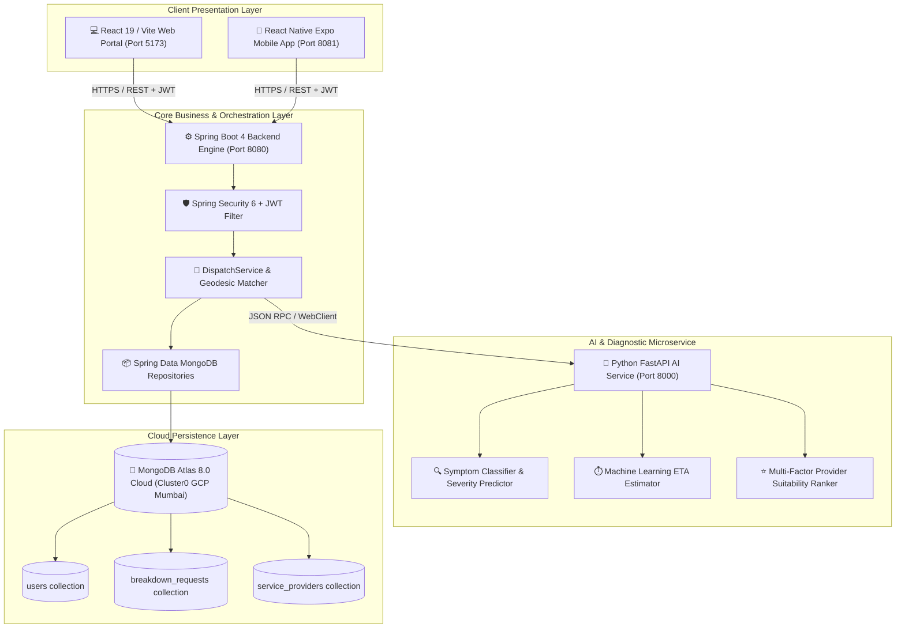
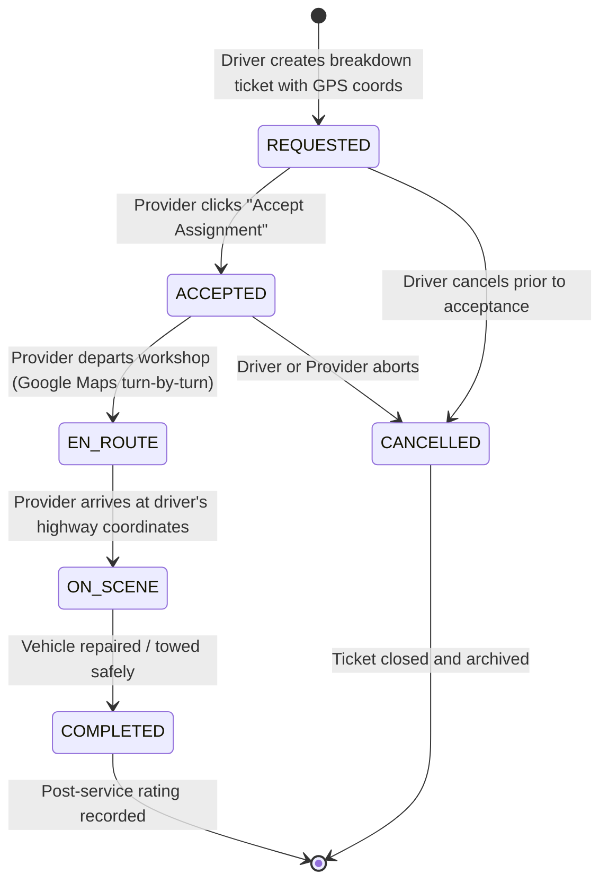

# System Architecture & Workflows — Pravaha AI
### *MOVEMENT • SUPPORT • SAFETY*

This document provides architectural blueprints, component diagrams, state transition models, and end-to-end execution flows for the Pravaha AI platform.

---

## 1. 🏗️ High-Level System Topology



---

## 2. 🔄 End-to-End Assistance Sequence

The sequence diagram below details the entire lifecycle from the moment a driver experiences a breakdown to post-service review:

```mermaid
sequenceDiagram
    autonumber
    actor Driver as 🚗 Stranded Driver
    participant App as 💻 Web / Mobile App
    participant Spring as ⚙️ Spring Boot Backend (8080)
    participant AI as 🧠 FastAPI AI Engine (8000)
    participant Atlas as 🍃 MongoDB Atlas Cloud
    actor Provider as 🔧 Service Provider (Apex Auto)

    Driver->>App: 1. Selects Issue (e.g. Flat Tire) & describes symptoms
    App->>Spring: 2. POST /api/driver/diagnose {problem, symptoms}
    Spring->>AI: 3. POST /ai/breakdown/classify
    AI-->>Spring: 4. Returns {severity: "HIGH", requiredRig: "Mobile Puncture Unit", duration: 30m}
    Spring-->>App: 5. Displays AI Diagnostic Analysis to Driver

    Driver->>App: 6. Clicks "Request Roadside Assistance"
    App->>Spring: 7. POST /api/driver/request-assistance {coords, problem, vehicle}
    Spring->>Atlas: 8. Queries active On-Duty providers (Haversine 15km)
    Atlas-->>Spring: 9. Returns candidates within radius
    Spring->>AI: 10. POST /ai/provider/recommend (Calculates suitability score)
    AI-->>Spring: 11. Returns ranked providers + predicted ETA
    Spring->>Atlas: 12. Inserts BreakdownRequest (status: REQUESTED)
    Spring-->>App: 13. Returns activeRequest with live Leaflet Map tracking

    Provider->>App: 14. Provider Hub polls incoming jobs (/api/provider/incoming)
    Spring-->>Provider: 15. Notifies: New Breakdown Request within 4.2 km
    Provider->>Spring: 16. POST /api/provider/requests/{id}/status {status: ACCEPTED}
    Spring->>Atlas: 17. Updates status -> ACCEPTED, assigns provider ID

    Provider->>Spring: 18. POST /api/provider/requests/{id}/status {status: EN_ROUTE}
    Spring->>Atlas: 19. Updates status -> EN_ROUTE
    App-->>Driver: 20. Live Stepper advances: "Mechanic En Route! ETA 14 mins"

    Provider->>Spring: 21. POST /api/provider/requests/{id}/status {status: ON_SCENE}
    Spring->>Atlas: 22. Updates status -> ON_SCENE
    App-->>Driver: 23. Notification: "Technician Arrived On Scene"

    Provider->>Spring: 24. POST /api/provider/requests/{id}/status {status: COMPLETED}
    Spring->>Atlas: 25. Updates status -> COMPLETED, records resolution note
    App-->>Driver: 26. Prompts Driver: "Service Completed! Rate Your Experience"

    Driver->>Spring: 27. POST /api/driver/rate {requestId, rating: 5, review: "Great service!"}
    Spring->>Atlas: 28. Updates provider aggregate rating & total jobs count
    Spring-->>App: 29. Success response; request archived in history ledger
```

---

## 3. 🚦 Dispatch State Machine

The breakdown dispatch request follows an immutable, audit-trailed state machine defined in [RequestStatus.java](file:///d:/Projects/Major-proj-1/smartroad-backend/src/main/java/com/smartroad/model/RequestStatus.java):



### Transition Verification Rules
| From State | To State | Initiator | Validations |
|---|---|---|---|
| `*` | `REQUESTED` | Driver | Valid vehicle registered, non-null GPS lat/lng, active breakdown problem. |
| `REQUESTED` | `ACCEPTED` | Provider | Provider must be active, on-duty (`available = true`), and within range. |
| `ACCEPTED` | `EN_ROUTE` | Provider | Provider verified; updates driver's ETA window. |
| `EN_ROUTE` | `ON_SCENE` | Provider | Arrived at telemetry coordinates. |
| `ON_SCENE` | `COMPLETED` | Provider | Repair finished; resolution notes and final fee confirmed. |
| `ANY (pre-completion)` | `CANCELLED` | Either | Mandatory cancellation reason logged in `StatusHistoryItem`. |

---

## 4. 🧮 Spatial & Heuristic Algorithms

### A. Geodesic Haversine Proximity Calculation
Located in [DispatchService.java](file:///d:/Projects/Major-proj-1/smartroad-backend/src/main/java/com/smartroad/service/DispatchService.java#L238-L260):

$$\begin{aligned}
\Delta\text{lat} &= \text{radians}(\text{lat}_2 - \text{lat}_1) \\
\Delta\text{lon} &= \text{radians}(\text{lon}_2 - \text{lon}_1) \\
a &= \sin^2\left(\frac{\Delta\text{lat}}{2}\right) + \cos(\text{radians}(\text{lat}_1)) \cdot \cos(\text{radians}(\text{lat}_2)) \cdot \sin^2\left(\frac{\Delta\text{lon}}{2}\right) \\
c &= 2 \cdot \text{atan2}(\sqrt{a}, \sqrt{1 - a}) \\
\text{Distance} &= 6371.0 \times c \quad (\text{kilometers})
\end{aligned}$$

### B. Multi-Factor Provider Suitability Score
Executed in the FastAPI AI microservice [app/services.py](file:///d:/Projects/Major-proj-1/smartroad-ai/app/services.py):

$$\text{Suitability Score} = (0.50 \times \text{Proximity Score}) + (0.35 \times \text{Rating Score}) + (0.15 \times \text{Service Match Factor})$$

Where:
- $\text{Proximity Score} = \max\left(0, 1.0 - \frac{\text{Distance Km}}{25.0}\right)$
- $\text{Rating Score} = \frac{\text{Star Rating}}{5.0}$
- $\text{Service Match Factor} = 1.0 \text{ if provider offers exact specialty, else } 0.6$

### C. Traffic-Aware Dynamic ETA Prediction
$$\text{ETA Minutes} = \text{round}\left( \frac{\text{Distance Km}}{35.0\text{ km/h (urban highway)}} \times 60 + 5.0\text{ min prep time} \right)$$
Bounded by minimum of 8 minutes and expressed with uncertainty range: $\pm 3\text{ minutes}$.
